# Architecture Diagrams

This document contains Mermaid diagrams that visualize the system architecture. These render automatically on GitHub.

---

## System Overview

---

## Search Flow - Clear Query

---

## Search Flow - Clarification Needed

---

## Embedding Generation Flow

---

## Database Schema

---

## Data Flow - Vector Search

---

## Component Dependencies

---

## Scaling Strategy

---

## Security Model

---

## Monitoring & Analytics Flow

---

## Cost Optimization Strategy

---

## Deployment Pipeline

---

## Migration Timeline

```mermaid
gantt
    title Migration from n8n to Edge Functions
    dateFormat  HH:mm
    axisFormat %H:%M

    section Preparation
    Review documentation           :done, prep1, 00:00, 30m
    Install dependencies           :done, prep2, after prep1, 30m

    section Database
    Link Supabase project         :active, db1, after prep2, 15m
    Run migrations                :db2, after db1, 30m
    Verify schema                 :db3, after db2, 15m

    section Edge Functions
    Configure OpenAI key          :ef1, after db3, 10m
    Deploy chat_search            :ef2, after ef1, 20m
    Deploy generate_embeddings    :ef3, after ef2, 20m
    Test with cURL                :ef4, after ef3, 30m

    section Data
    Generate embeddings (batch 1) :data1, after ef4, 60m
    Generate embeddings (batch 2) :data2, after data1, 60m
    Verify coverage               :data3, after data2, 15m

    section App Integration
    Add searchService.js          :app1, after data3, 30m
    Update SearchScreen.js        :app2, after app1, 60m
    Test on simulator             :app3, after app2, 30m
    Fix any issues                :app4, after app3, 30m

    section Testing & Launch
    Integration tests             :test1, after app4, 45m
    User acceptance testing       :test2, after test1, 60m
    Deploy to production          :launch, after test2, 30m
    Monitor initial usage         :monitor, after launch, 120m
```

**Total Estimated Time:** 10-12 hours (spread over 2-3 days)

---

These diagrams provide a visual understanding of the system architecture, data flows, and deployment process. They render automatically on GitHub for easy reference.
